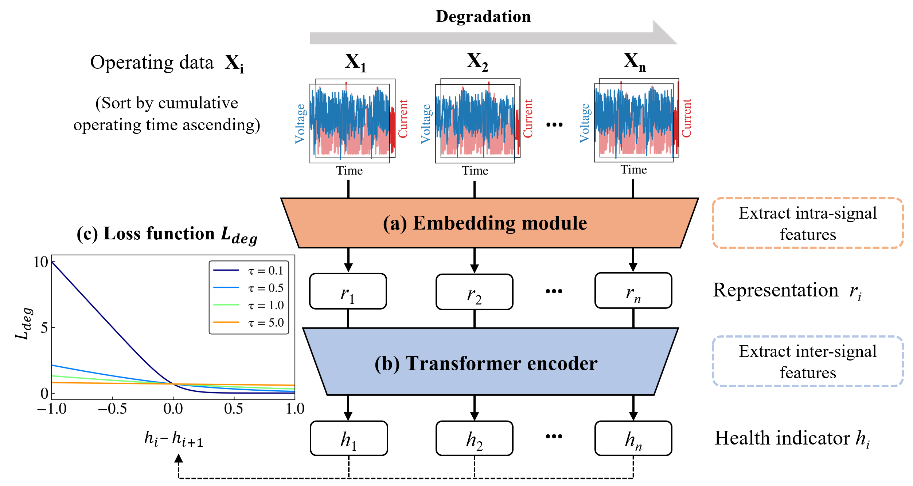
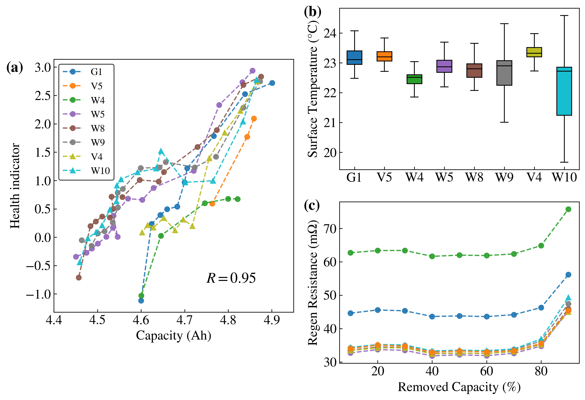

[](https://arxiv.org/abs/2503.08083)

## Degradation-Based Self-Supervised Learning  

### Overview  



### Installation  

This model is implemented on `python 3.10` with `torch 2.2.0+cu118`  

To install pytorch:
```
pip install torch==2.2.0 torchvision==0.17.0 torchaudio==2.2.0 --index-url https://download.pytorch.org/whl/cu118

```
Other packages can be installed by:
```
pip install -r requirements.txt
```

### Quick Start  

#### Inference  

Download the pre-trained model [here]()

#### Training  

...

### Result

